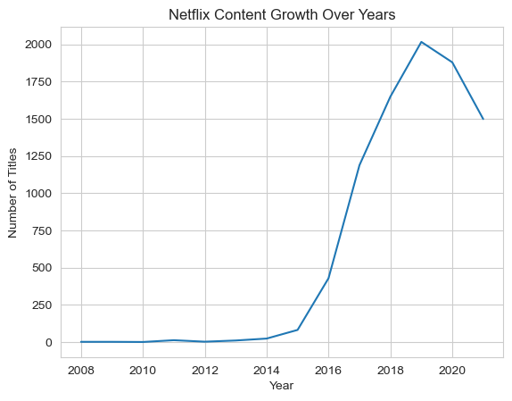
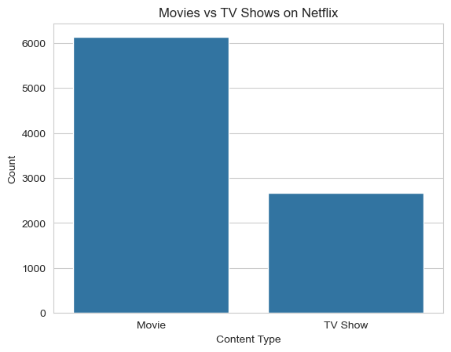
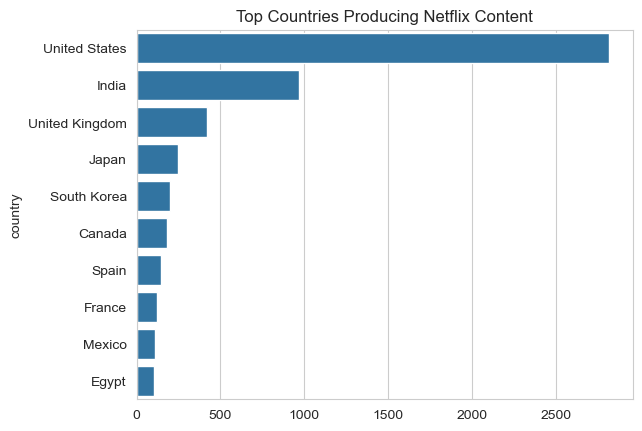
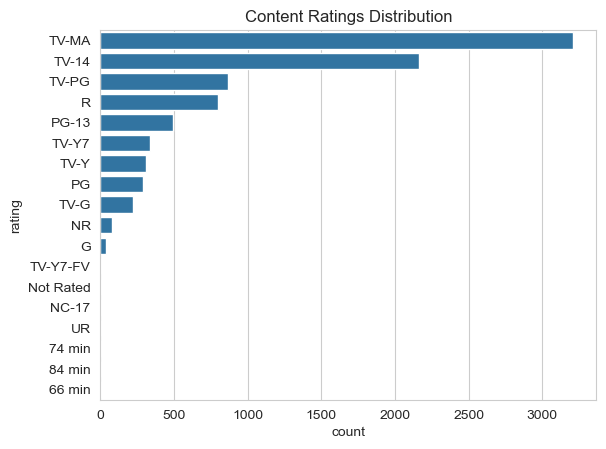
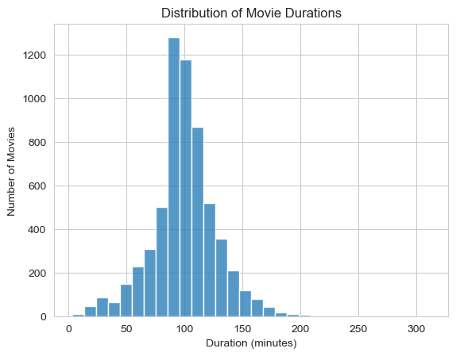
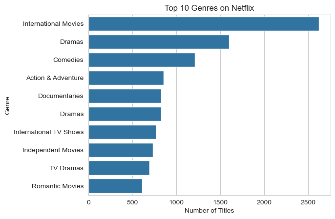

# 🎬 Netflix Data Analysis
---
⭐ Exploratory Data Analysis Project
Tools Used: Python | Pandas | Matplotlib | Seaborn
Focus: Content Strategy & Business Insights
---

## Overview
---

This project performs Exploratory Data Analysis (EDA) on the Netflix titles dataset to uncover trends, patterns, and insights related to content distribution, growth, and strategy.

The goal is to transform raw data into meaningful insights that can guide business decisions.
---

## 🎯 Problem Statement

With thousands of titles available on Netflix, understanding content trends is crucial.
This project aims to:

- Analyze growth of Netflix content over time
- Compare Movies vs TV Shows distribution
- Identify top countries and genres
- Extract insights for content strategy

## Dataset
The dataset contains information about 8800+ Netflix titles, including:

- Title
- Type (Movie / TV Show)
- Country
- Release Year
- Duration
- Genre
- Rating
- Director

---

## ⚙️ Tools Used
---
- Python → Data cleaning & analysis
- Pandas → Data manipulation
- Matplotlib & Seaborn → Data visualization
- Jupyter Notebook → Interactive analysis

---

## 🔍 Data Analysis Workflow
- Data Cleaning & Preprocessing
- Handling missing values
- Exploratory Data Analysis (EDA)
- Visualization of trends and distributions
- Insight generation

  ---
  
## 📊 Key Insights
- Netflix content increased rapidly after 2016, showing aggressive expansion
- Movies dominate (~70%) the platform compared to TV Shows
- The United States produces the highest number of titles
- Most movies have a duration of 90–120 minutes
- Drama and International genres are among the most popular

  ---
## 📈 Business Insights
- Netflix focuses heavily on movie-based content, indicating a strategy toward quick-consumption entertainment
- Rapid content growth post-2016 suggests increased competition in streaming industry
- Heavy reliance on US content highlights an opportunity for regional diversification
- Rising international content indicates Netflix’s push toward global audience expansion

---

## 💡Business Recommendations
- Increase investment in regional and international content
- Expand high-performing genres like Drama and International shows
- Balance between Movies and TV Shows to improve user engagement
- Focus on producing binge-worthy series to retain users

---

## Visualizations

### Netflix Content Growth

### Movies vs TV Shows

### Top Countries Producing Content

### Rating Distribution

### Movie Duration

### Top Genres

---

## 🧠 Why This Project Matters

This project demonstrates the ability to:

- Perform real-world data analysis
- Extract meaningful insights from large datasets
- Translate data into business strategies
- Communicate findings effectively

## Project Structure

netflix-data-analysis
│── data → Raw dataset
│── notebook → Jupyter Notebook analysis
│── images → Visualizations
│── README.md

---
## 👨‍💻 Author

Vijay Saroj
B.Tech (ECE), IIT (ISM) Dhanbad
